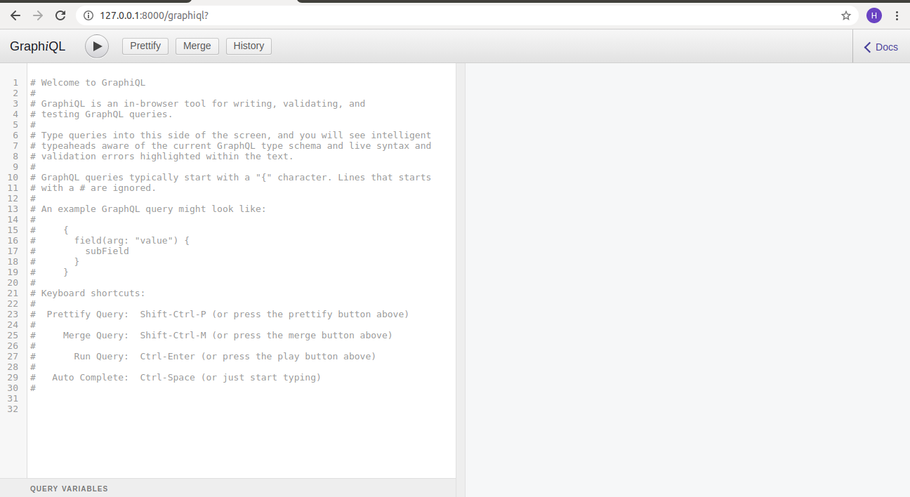

## **GraphQL with Laravel**

#### **What is GraphQL**

GraphQL is open source data query language for APIs and a runtime for fulfilling those queries with your existing data.
GraphQL was developed internally by Facebook in 2012. GraphQL provides a complete and understandable description of the data in your API,
gives clients the power to ask for exactly what they need and nothing more, makes it easier to evolve APIs over time, and enables powerful developer tools.

#### **Why should we use GraphQL**

Apps using GraphQL are fast and stable because they control the data they get, not the server. 

Send a GraphQL query to your API and get exactly what you need, nothing more and nothing less.

GraphQL queries always return predictable results.

GraphQL queries access not just the properties of one resource but also smoothly follow references between them.

While typical REST APIs require loading from multiple URLs, GraphQL APIs get all the data your app needs in a single request.

Apps using GraphQL can be quick even on slow mobile network connections.

Access the full capabilities of your data from a single endpoint.

GraphQL uses types to ensure Apps only ask for what’s possible and provide clear and helpful errors.

Apps can use types to avoid writing manual parsing code.

GraphQL APIs give apps continuous access to new features and encourage cleaner, more maintainable server code.

Write GraphQL APIs that leverage your existing data and code with GrapWe are going to implement GraphQL to our laravel App. let's follow the below steps.hQL engines available in many languages.

You provide functions for each field in the type system, and GraphQL calls them with optimal concurrency.

#### **How to implement GraphQL**

Follow the steps for implement GraphQL in Laravel

**1) create one laravel project.**

    composer create-project --prefer-dist laravel/laravel laraGraphQL
    
After project creation do the migration

    php artisan migrate

**3) Install the GraphQL Library**

To support GraphQL in the application, we need to install a library that allows us to define schemas and queries in a simple way.

    composer require rebing/graphql-laravel
    
After the installation, we need to run the following command:

    php artisan vendor:publish --provider="Rebing\GraphQL\GraphQLServiceProvider"
    
This command extracts the `graphql.php` configuration file from the vendor folder and put it into the config folder.

**4) Create the GraphQL Type**

We will start by creating the API's schema by defining the resource returned. 
To do this, create the `GraphQL` directory inside the app directory. This directory will contain all the definitions we need for the GraphQL schema of the API.
In the `app/GraphQL` directory, create the Types directory and put in it a file called `UserType.php`.
        
            protected $attributes = [
                //Add attributes here
            ];
        
            public function fields(): array
            {
                return [
                 //Add return fields here   
                ];
            }
    
**5) Create the GraphQL Queries**

Create a Queries directory inside the `./app/GraphQL` directory and put there a file called `UsersQuery.php`. Query files use for fetch data.
For Ex.          
       
            protected $attributes = [
                //Add attributes here
            ];
        
            public function type(): Type
            {
                return GraphQL::type('User');
            }
        
            public function args(): array
            {
                return [
                    //Return fields here
                ];
            }
        
            public function resolve($root, $args, $context, ResolveInfo $info)
            {
                //Add your query here
            } 

**6) Registering the Schema**

After creating these types and queries, you need to register these items as the GraphQL schema in your API. 
Let's open the `config/graphql.php` file and replace the current definition of 'schemas' with the following:

    'schemas' => [
            'default' => [
                'query' => [
                     //Add your queries here
                ],                
            ],
        ],

Then, in the same file, replace the current definition of 'types' with the following:

    'types' => [
            //Add your types here
    ],
 
**7) Create a Mutations**

Now let’s add a Mutations for add, update and delete operations. 
Create a `Mutations` directory inside the `./app/GraphQL` directory and put there a file, ex. `NewUserMutation.php`.

            protected $attributes = [
                //Add attributes here
            ];
        
            public function type(): Type
            {
                return GraphQL::type('User');
            }
        
            public function args(): array
            {
                return [
                    
                ];
            }
        
            public function resolve($rootValue, array $args)
            {
                //Add you query
            }

Let's register mutations in `config/graphql.php` file.

    'schemas' => [
            'default' => [
                ....
                'mutation' => [
                    //Add your mutator here
                ],
                ....
            ],
        ],

**8) Testing the API with GraphiQL**

For the testing in graphql, we need to download graphql and install it to our system. you can download it from here https://www.electronjs.org/apps/graphiql
and run below command to terminal.

    php artisan serve
    
Lets run it on browser.

    http://127.0.0.1:8000/graphiql
    
And then you can see the below screen.

 

Let's write a queries.

Get User

That's it. Happy Coding :)

